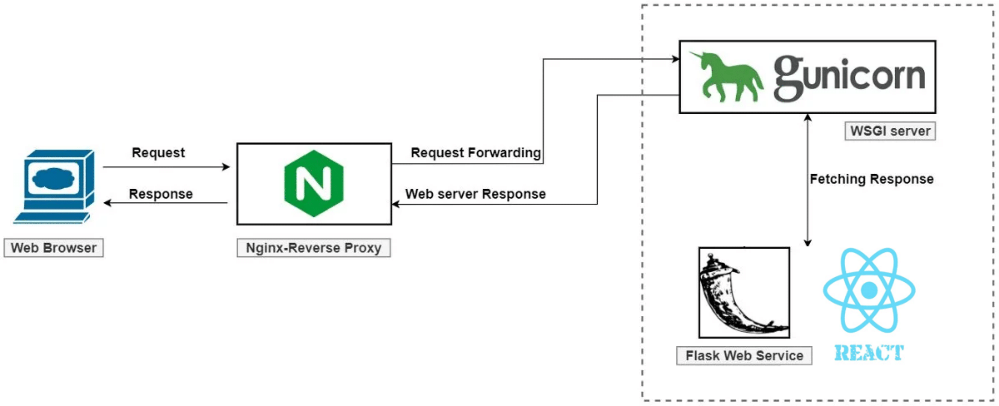

# React README

located ./mathsearch README.md

# Frontend Public IP

### As time: 5/29 3:12PM

Everytime EC2 instance gets restarted, new IP and new SSH ip is be generated and need to be updated for config and domain redirection.

- Public IP: `http://54.209.133.135`
- SSH: `ec2-54-209-133-135.compute-1.amazonaws.com`

# Architecture

## Endpoints:

1. React: main page + live render. Public IP: `http://ip/` or `http://ip/xxx`
2. Flask: listen for other ports. Public IP: `http://ip/api/xxx`, notice the /api prefix before everything. You will need to write that in the flask app `api.py`

## Deployment

1. Gunicorn: host flask, easy to start new ports
2. Nginx: web serving, connect gunicorn, reverse proxying, caching. But basically, all you need to know is it redirect and make the port `http://127.0.0.1:8000` visiable at `http://ip`, which is the react contents, and `http://127.0.0.1:8000/api` at `http://ip/api`, which is the flask ports.



# Frontend Environment:

Coding should be done on EC2 directly for better testing purposes, and the venv is created at `/home/ubuntu/MathSearch/front-end/venv` already  
If you have to test on your local for some reason, manually create venv with requirements.txt, and to activate the virtual environment  
put your venv in `/home/ubuntu/MathSearch/front-end` and cd into it

```
source venv/bin/activate
```

# Commands You Need

## When Update React

after `npm run build`

```
sudo service nginx restart
```

which is the same as `sudo systemctl restart nginx`

## When Update Flask

first kill gunicorn, grep pid and kill that pid  
it should be something like: 34702 pts/39 S+ 0:00 /.../python3 /.../gunicorn -b 127.0.0.1:8000 api:app

```
sudo ps ax | grep 8000
kill <gunicorn_pid>
```

or

```
pkill gunicorn
```

then

```
cd ~/MathSearch/front-end/web
gunicorn -b 127.0.0.1:8000 api:app
```

You must be in `/web` to let gunicorn start app  
-b stands for bind which specify the IP address  
above command start gunicorn which run flask, do NOT end this process

# Other Things - You probably do not need to know

### 1. start the Nginx service

Can go to the Public IP address of EC2 on the browser to see the default nginx landing page

```
sudo systemctl start nginx
```

### 2. enable auto-start gunicorn service after reboot

```
sudo systemctl enable nginx
```

### 3. check if frontend work on local

Option 1:
visit `127.0.0.1:8000/test`

Option 2:

```
curl localhost:8000/test
```

Option 3:

```
gunicorn -b 127.0.0.1:8000 api:app
```

if get [ERROR] Connection in use: ('127.0.0.1', 8000), you need to stop public deployment to deploy to local, do a pid kill

### 4. check gunicorn status - deployment to public

```
sudo systemctl status nginx
```

### 5. check nginx.conf syntax

```
sudo nginx -t
```

### 6. reload config

```
sudo service nginx restart
```

### 6. reference:

There's no references anymore. Too many sites had been used during debug. Just slack if you need support on anything.

### 8. location of important files:

1. `/etc/nginx/nginx.conf`
2. `/lib/systemd/system/nginx.service`
3. (unused) `/etc/nginx/sites-available/MathSearch`


## Access S3
To test connection, run below (notice the "-" on the second option). It should display directory in s3 buckets or cat the file.

option 1
```
aws s3 ls s3://mathsearch-intermediary
```
option 2
```
aws s3 cp s3://mathsearch-intermediary/test.txt -
```